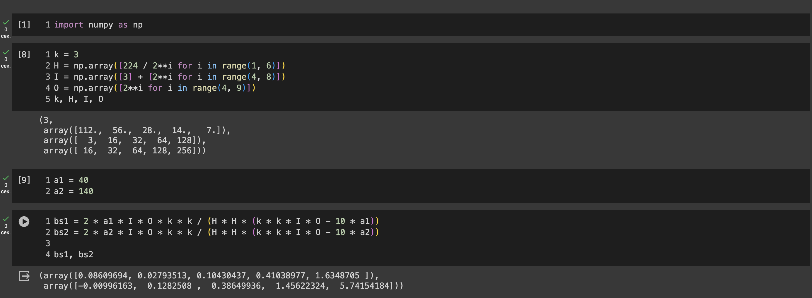

# Nano Computer Vision model

### Setup:

- macOS Ventura 13.6.1
- 2 GHz 4‑ядерный процессор Intel Core i5
- 16 ГБ 3733 MHz LPDDR4X

---

### Description

#### The primary goal of this repository is to solve different computer vision problems, such as:

- image classification
- object detection (TBD)
- segmentation (TBD)
- generation (TBD)

User have an opportunity to download pretrained weights from dvc or train his
own model on provided datasets.

## Example: Flowers classification


```bash
poetry install
poetry shell

dvc pull

python train.py +data=flowers +model=lenet # train model lenet on flowers dataset
python infer.py +data=flowers +model=lenet # infer model lenet on flowers dataset
```

```bash
python export_model.py +data=flowers +model=lenet # export model to onnx
```

### Model repository structure


## Triton server metrics

В качестве основных метрик будем смотреть на `latency99`, `latency90` и
`throughput` при `concurrency == 4`

### Instance number: 1

| metrics value      | max batch | max queue delay (mcs) | metric value |
| ------------------ | :-------: | :-------------------: | -----------: |
| latency90 (usec)   |     4     |         1000          |        19962 |
| latency99 (usec)   |     4     |         1000          |        27117 |
| throughput (inf/s) |     4     |         1000          |      233.097 |
| latency90 (usec)   |     4     |          500          |        16475 |
| latency99 (usec)   |     4     |          500          |        23288 |
| throughput (inf/s) |     4     |          500          |      256.486 |
| latency90 (usec)   |     4     |         2000          |        17884 |
| latency99 (usec)   |     4     |         2000          |        24160 |
| throughput (inf/s) |     4     |         2000          |      241.077 |
| latency90 (usec)   |     4     |         4000          |        17249 |
| latency99 (usec)   |     4     |         4000          |        22958 |
| throughput (inf/s) |     4     |         4000          |      252.268 |

Судя по метрикам правильнее будет использовать `max queue delay ms == 4000`, так
как при таком делее разница между `latency90` и `latency99` наименьшая, а
`throughput` практически достигает максимума.

---

_при замерах `count == 2` метрики были сильно хуже_

### Подсчет ограниченности по арифметике или памяти

_Предполагаем, что я запускаю модель на V100 => Пороги: 40 - 140_

`FLOPS(conv2d) == 2 x N x OUT x IN x Kx x Ky x H_OUT x W_OUT`

`FLOPS(FC) == 2 x N x OUT x IN`

| layer name | kernel | in/out channels | in/out size | MFLOPS | NPARAMS |
| ---------- | :----: | :-------------: | ----------: | -----: | ------: |
| conv1      |  3x3   |      3/16       |     224/112 | 10,838 | NPARAMS |
| conv2      |  3x3   |      16/32      |      112/56 | 28,901 | NPARAMS |
| conv3      |  3x3   |      32/64      |       56/28 | 28,901 | NPARAMS |
| conv4      |  3x3   |     64/128      |       28/14 | 28,901 | NPARAMS |
| conv5      |  3x3   |     128/256     |        14/7 | 28,901 | NPARAMS |
| clf        |  nan   |    7*7*256/4    |         nan |    0.1 | NPARAMS |

Conv2D:



_Из последних строчек на скриншоте видно, что размеры сверток в совокупности с
FP32 не очень эффективно работают_
